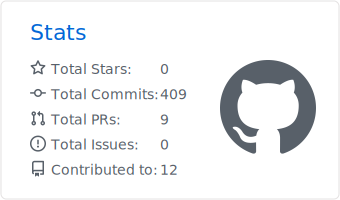
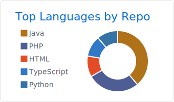
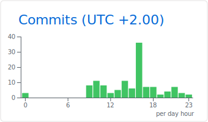

<!-- ─────────────────────────────  HEADER  ───────────────────────────── -->


# Yohan Baechle

### Build. Ship. Secure.

**Full-stack developer** and **MSc Cloud &amp; Cybersecurity** student at **Epitech**.
I build web and mobile apps with **TypeScript**, **Laravel** and **Flutter**,
and I'm going deeper into cloud infrastructure and security.

📍 France · [LinkedIn](https://www.linkedin.com/in/yohanbaechle/) · [Email](mailto:baechle.yohan@gmail.com)

<br/>

<!-- ─────────────────────────────  WHOAMI  ───────────────────────────── -->
### // stack

```ts
const yohan = {
  role:     "Full-stack developer · MSc Cloud & Cybersecurity @ Epitech",
  building: ["TypeScript", "Laravel", "Symfony", "React", "Next.js", "Flutter"],
  breaking: ["Cloud", "Security", "Linux", "Networking"], // I break codes. Both kinds.
} as const;
```


<br/>
<br/>

<!-- ─────────────────────────────  STATS  ────────────────────────────── -->
### // activity

<div align="center">

<picture>
  <source media="(prefers-color-scheme: dark)" srcset="./profile-summary-card-output/tokyonight/3-stats.svg" />
  
</picture>
<picture>
  <source media="(prefers-color-scheme: dark)" srcset="./profile-summary-card-output/tokyonight/1-repos-per-language.svg" />
  
</picture>

<picture>
  <source media="(prefers-color-scheme: dark)" srcset="./profile-summary-card-output/tokyonight/4-productive-time.svg" />
  
</picture>

</div>
