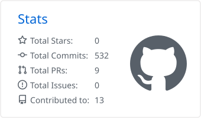
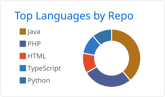
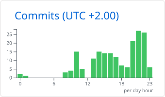

# Yohan Baechlé

**Full-stack developer** moving deeper into **cloud and cybersecurity**. MSc Pro student at Epitech (Nancy, France).

I build web and mobile apps end to end, and I spend as much time on the code as on what runs it: containers, CI/CD, infrastructure and security.

📍 France&nbsp;&nbsp;·&nbsp;&nbsp;[LinkedIn](https://www.linkedin.com/in/yohanbaechle/)&nbsp;&nbsp;·&nbsp;&nbsp;[baechle.yohan@gmail.com](mailto:baechle.yohan@gmail.com)

---

### Currently

- Building a full Kubernetes cluster on AWS and moving a docker-compose app to a GitOps workflow ([kubequest](https://github.com/Yohan-Baechle/kubequest))
- Deploying a hardened multi-site infrastructure with Proxmox, pfSense and Ansible ([T-NSA-CIA](https://github.com/Yohan-Baechle/T-NSA-810))
- Studying cloud architecture and offensive/defensive security at Epitech

### Skills

**Languages**

**Backend &amp; Frontend**

**Cloud &amp; DevOps**

---

### Featured projects

| Project | What it is | Stack |
| --- | --- | --- |
| **[kubequest](https://github.com/Yohan-Baechle/kubequest)** | Full Kubernetes cluster on AWS, plus a docker-compose app migrated to a GitOps deployment | Kubernetes, Helm, Ansible, AWS |
| **[T-NSA-CIA](https://github.com/Yohan-Baechle/T-NSA-810)** | Hybrid multi-site infrastructure: pfSense firewalls, site-to-site VPN, NetBox IPAM, observability | Proxmox, pfSense, Ansible, Elasticsearch |
| **[zenmanager](https://github.com/Yohan-Baechle/zenmanager)** | Time-management app, Symfony API and React frontend, containerized with CI | Symfony, React, Docker |
| **[vivre-pleinement](https://github.com/Yohan-Baechle/vivre-pleinement)** | Professional website built on Laravel with a CI/CD pipeline | Laravel, Docker, GitHub Actions |

---

### Activity

<picture>
  <source media="(prefers-color-scheme: dark)" srcset="./profile-summary-card-output/tokyonight/3-stats.svg" />
  
</picture>
<picture>
  <source media="(prefers-color-scheme: dark)" srcset="./profile-summary-card-output/tokyonight/1-repos-per-language.svg" />
  
</picture>

<picture>
  <source media="(prefers-color-scheme: dark)" srcset="./profile-summary-card-output/tokyonight/4-productive-time.svg" />
  
</picture>

